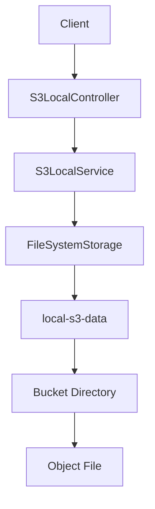

# Local S3 Feature Plan

## Scope
Create `[docs/s3-local-system-plan.md](docs/s3-local-system-plan.md)` documenting a basic local S3-like system for this Spring Boot app. The implementation target is a local-only storage service, not a real AWS S3 client or cloud integration.

The first feature set will cover:

- Create a bucket.
- List buckets.
- Put an object into a bucket.
- Get an object from a bucket.
- List objects in a bucket.
- Delete an object using a POST-style testing API action, because `.cursor/rules/api-get-post-strings.mdc` restricts test APIs to GET and POST.

## Existing Project Context
The project is currently a small Spring Boot 4 application with Web MVC and Actuator from `[pom.xml](pom.xml)`. It has a main application class at `[src/main/java/sb/concepts/lab/SbConceptsLabApplication.java](src/main/java/sb/concepts/lab/SbConceptsLabApplication.java)` and a simple test controller at `[src/main/java/sb/concepts/lab/TestController.java](src/main/java/sb/concepts/lab/TestController.java)`.

The plan should align with this existing package root:

```java
package sb.concepts.lab;
```

## Proposed Design
Use the local filesystem as the storage backend. Configure a root folder such as `./local-s3-data`, where each bucket is a directory and each object key is stored as a file path under that bucket.



Recommended package structure:

- `[src/main/java/sb/concepts/lab/s3local/S3LocalController.java](src/main/java/sb/concepts/lab/s3local/S3LocalController.java)` for HTTP endpoints.
- `[src/main/java/sb/concepts/lab/s3local/S3LocalService.java](src/main/java/sb/concepts/lab/s3local/S3LocalService.java)` for bucket/object behavior.
- `[src/main/java/sb/concepts/lab/s3local/FileSystemStorage.java](src/main/java/sb/concepts/lab/s3local/FileSystemStorage.java)` for filesystem reads/writes.
- `[src/main/java/sb/concepts/lab/s3local/S3LocalProperties.java](src/main/java/sb/concepts/lab/s3local/S3LocalProperties.java)` for configurable storage root.

## API Shape
Keep APIs simple and string-based:

- `POST /app/v1/s3/buckets` with bucket name as a string request body.
- `GET /app/v1/s3/buckets` returns bucket names as a string.
- `POST /app/v1/s3/objects` with a string body containing bucket, key, and content using a documented delimiter or simple JSON string if allowed later.
- `GET /app/v1/s3/objects?bucket={bucket}&key={key}` returns object content as a string.
- `GET /app/v1/s3/objects/list?bucket={bucket}` returns object keys as a string.
- `POST /app/v1/s3/objects/delete` with bucket and key as a string body.

Because the current rule says API request and response values should be strings, avoid typed DTO fields unless the user explicitly approves them.

## Storage Rules
The docs plan should specify these invariants before implementation:

- Bucket names are normalized and validated to avoid empty names and path traversal.
- Object keys must stay inside the bucket directory after path normalization.
- Object content is stored as UTF-8 text for the first version.
- Existing object keys can be overwritten by `put object` unless later requirements say otherwise.
- Missing buckets or objects return clear string messages through the API.

## Test Plan
Add focused tests after implementation:

- Service test for bucket creation and listing.
- Service test for object put/get/list/delete.
- Path traversal rejection test for bucket names and object keys.
- Controller test for the string-based GET/POST endpoints.

## Follow-Up Options
Defer these until the basic system works:

- Object metadata.
- Versioning.
- Multipart-like upload simulation.
- Presigned-style local URLs.
- Auth simulation.
- Lifecycle or retention policies.