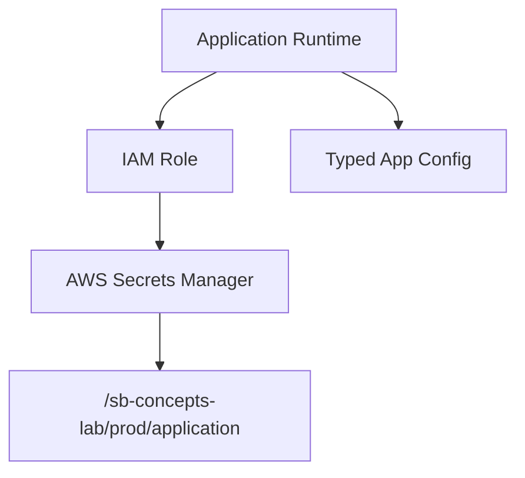

# Secure Profile Properties Guide

This document explains which application profile values can be committed safely, which values must stay secure, and how to provide defaults when running production-like profiles locally.

The project currently has these profile files:

- `src/main/resources/application.yaml`
- `src/main/resources/application-local.yaml`
- `src/main/resources/application-dev.yaml`
- `src/main/resources/application-qa.yaml`
- `src/main/resources/application-prod.yaml`
- `src/main/resources/application-localstack.yaml`

## What Can Be Committed

These values are normally safe to keep in Git because they do not grant access to a system:

| Property | Example | Reason |
| --- | --- | --- |
| `spring.application.name` | `sb-concepts-lab` | Application identity only. |
| `spring.config.activate.on-profile` | `prod` | Profile activation metadata. |
| `server.port` | `8083` | Runtime port only. |
| `management.endpoints.web.exposure.include` | `health,info` | Non-secret operational setting. |
| `app.profile-name` | `prod` | Profile label only. |
| `app.description` | `Production profile...` | Documentation text only. |
| `app.aws.region` | `us-east-1` | Region is not a secret. |
| `app.aws.s3.endpoint` | `http://localhost:4566` | LocalStack endpoint is not a secret. |
| `app.aws.s3.bucket-prefix` | `sb-concepts-lab-prod` | Safe if it does not reveal sensitive business data. |

## What Must Be Secured

These values should not be committed with real production data:

| Property | Why It Is Sensitive | Secure Source |
| --- | --- | --- |
| `app.aws.access-key` | Can identify an AWS principal. | Environment variable, IAM role, or secrets manager. |
| `app.aws.secret-key` | Can authenticate to AWS. | Environment variable, IAM role, or secrets manager. |
| `app.aws.account-id` | Not a password, but should be treated carefully in public repos. | Environment variable in shared/prod environments. |
| Database passwords | Grants database access. | Secrets manager or environment variable. |
| API keys and tokens | Grants access to third-party systems. | Secrets manager or environment variable. |
| Private endpoints | May expose internal network details. | Environment-specific deployment config. |
| Encryption keys | Can decrypt protected data. | Managed key service or secrets manager. |

## Recommended Profile Strategy

### Local

Use safe defaults and dummy values. Local should be easy to run without cloud access.

```yaml
app:
  aws:
    region: ${AWS_REGION:us-east-1}
    account-id: ${AWS_ACCOUNT_ID:000000000000}
    access-key: ${AWS_ACCESS_KEY_ID:local}
    secret-key: ${AWS_SECRET_ACCESS_KEY:local}
    s3:
      endpoint: ${AWS_S3_ENDPOINT:http://localhost:4566}
      bucket-prefix: ${AWS_S3_BUCKET_PREFIX:sb-concepts-lab-local}
```

### Dev

Use environment variables for shared resources. Defaults can be allowed only when they point to safe non-production systems.

```yaml
app:
  aws:
    region: ${AWS_REGION:us-east-1}
    account-id: ${AWS_ACCOUNT_ID:000000000000}
    access-key: ${AWS_ACCESS_KEY_ID:dev-placeholder}
    secret-key: ${AWS_SECRET_ACCESS_KEY:dev-placeholder}
    s3:
      endpoint: ${AWS_S3_ENDPOINT:http://localhost:4566}
      bucket-prefix: ${AWS_S3_BUCKET_PREFIX:sb-concepts-lab-dev}
```

### Test or QA

QA should be stable and repeatable. Use dedicated test credentials or, preferably, IAM roles in the QA runtime environment.

```yaml
app:
  aws:
    region: ${AWS_REGION:us-east-1}
    account-id: ${AWS_ACCOUNT_ID:000000000000}
    access-key: ${AWS_ACCESS_KEY_ID:qa-placeholder}
    secret-key: ${AWS_SECRET_ACCESS_KEY:qa-placeholder}
    s3:
      endpoint: ${AWS_S3_ENDPOINT:http://localhost:4566}
      bucket-prefix: ${AWS_S3_BUCKET_PREFIX:sb-concepts-lab-qa}
```

### Prod

Production should not depend on committed credentials. Prefer AWS IAM roles, workload identity, or a managed secrets service. If a local developer runs the `prod` profile for simulation, use safe defaults that clearly do not represent real credentials.

```yaml
app:
  aws:
    region: ${AWS_REGION:us-east-1}
    account-id: ${AWS_ACCOUNT_ID:local-prod-simulation}
    access-key: ${AWS_ACCESS_KEY_ID:use-iam-role-in-real-prod}
    secret-key: ${AWS_SECRET_ACCESS_KEY:use-secrets-manager-in-real-prod}
    s3:
      endpoint: ${AWS_S3_ENDPOINT:aws-managed}
      bucket-prefix: ${AWS_S3_BUCKET_PREFIX:sb-concepts-lab-prod}
```

This pattern means:

- If `AWS_REGION` exists, Spring uses that value.
- If `AWS_REGION` does not exist, Spring uses `us-east-1`.
- If `AWS_SECRET_ACCESS_KEY` does not exist, Spring uses the safe text value `use-secrets-manager-in-real-prod`.

## How Spring Default Values Work

Spring Boot supports placeholder defaults with this syntax:

```yaml
property-name: ${ENVIRONMENT_VARIABLE:default-value}
```

Examples:

```yaml
app:
  aws:
    region: ${AWS_REGION:us-east-1}
    account-id: ${AWS_ACCOUNT_ID:local-prod-simulation}
```

Use this style when the application should still start locally without real secure data.

Do not use a real secret as the fallback value:

```yaml
# Do not do this.
app:
  aws:
    secret-key: ${AWS_SECRET_ACCESS_KEY:real-production-secret}
```

Use a safe placeholder instead:

```yaml
app:
  aws:
    secret-key: ${AWS_SECRET_ACCESS_KEY:use-secrets-manager-in-real-prod}
```

## How To Provide Secure Values

### PowerShell Local Run

Set values in the current terminal session:

```powershell
$env:AWS_REGION = "us-east-1"
$env:AWS_ACCOUNT_ID = "123456789012"
$env:AWS_ACCESS_KEY_ID = "local-test-key"
$env:AWS_SECRET_ACCESS_KEY = "local-test-secret"
$env:AWS_S3_BUCKET_PREFIX = "sb-concepts-lab-local"

.\mvnw.cmd spring-boot:run "-Dspring-boot.run.profiles=prod"
```

These values apply only to the current PowerShell session.

### CI or GitHub Actions

Store sensitive values in GitHub repository or environment secrets, then map them to environment variables during the build or deployment job.

Recommended names:

- `AWS_REGION`
- `AWS_ACCOUNT_ID`
- `AWS_ACCESS_KEY_ID`
- `AWS_SECRET_ACCESS_KEY`
- `AWS_S3_BUCKET_PREFIX`

### Real Production

For real production, prefer runtime identity over static credentials:

- Use AWS IAM roles for EC2, ECS, EKS, or Lambda.
- Use AWS Secrets Manager or SSM Parameter Store for application secrets.
- Do not commit `.env` files, access keys, secret keys, private certificates, or generated credentials.
- Avoid logging secrets or full connection strings.

## Production Profile Running Locally

When running `prod` locally, the goal is simulation, not real cloud access. The application should start even when secure values are not present.

Recommended local behavior:

- Use environment variables when they exist.
- Use safe placeholder defaults when they do not exist.
- Make default values obvious, for example `local-prod-simulation` or `use-iam-role-in-real-prod`.
- Never use real production secrets as defaults.

Example command:

```powershell
.\mvnw.cmd spring-boot:run "-Dspring-boot.run.profiles=prod"
```

If no secure environment variables are provided, Spring can still resolve the values from safe defaults:

```text
AWS_REGION -> us-east-1
AWS_ACCOUNT_ID -> local-prod-simulation
AWS_ACCESS_KEY_ID -> use-iam-role-in-real-prod
AWS_SECRET_ACCESS_KEY -> use-secrets-manager-in-real-prod
AWS_S3_BUCKET_PREFIX -> sb-concepts-lab-prod
```

## AWS Secrets Manager Implementation Plan

AWS Secrets Manager should hold values that are sensitive, rotated, or different per environment. The application should read those values at startup through a small service layer, not from committed YAML.

For this project, Secrets Manager should eventually own values like:

- `app.aws.account-id`
- `app.aws.access-key`, only when IAM roles are not available
- `app.aws.secret-key`, only when IAM roles are not available
- Future S3 bucket names if they reveal environment or customer details
- Database usernames and passwords
- Third-party API keys
- Encryption or signing keys

Do not store these values in Secrets Manager:

- `spring.application.name`
- `server.port`
- `app.profile-name`
- Non-sensitive feature labels
- Public local endpoints like `http://localhost:4566`

### Production-Like Secret Shape

Use one JSON secret per application and environment. This keeps retrieval simple and makes rotation easier to reason about.

Recommended secret name:

```text
/sb-concepts-lab/prod/application
```

Recommended secret value:

```json
{
  "awsRegion": "us-east-1",
  "awsAccountId": "123456789012",
  "s3BucketPrefix": "sb-concepts-lab-prod",
  "databaseUsername": "sb_concepts_app",
  "databasePassword": "replace-with-real-secret",
  "externalApiKey": "replace-with-real-secret"
}
```

The application should map this JSON into a typed configuration object later. Do not pass raw JSON around controllers or business services.

### Real Production Flow

In real production, avoid static AWS access keys. The runtime should receive AWS permission from its platform:



The production startup flow should be:

1. Application starts with `prod` profile.
2. AWS SDK uses the runtime IAM role automatically.
3. Application reads `/sb-concepts-lab/prod/application` from Secrets Manager.
4. Secret JSON is mapped into typed configuration.
5. The application fails fast if a required production secret is missing.

Failing fast is important in real production. A missing database password or API key should stop startup instead of silently using a dummy value.

### Maven Dependency Direction

When this project is ready to implement the real client, add the AWS SDK Secrets Manager dependency.

Recommended direction:

```xml
<dependency>
    <groupId>software.amazon.awssdk</groupId>
    <artifactId>secretsmanager</artifactId>
</dependency>
```

If the project later uses more AWS services, manage AWS SDK versions from a BOM instead of hard-coding versions on every dependency.

### Code Shape To Add Later

Keep AWS integration behind an application-owned interface. That keeps controllers and services clean and makes local simulation easy.

Recommended package:

```text
src/main/java/sb/concepts/lab/secrets
```

Recommended classes:

```text
ApplicationSecretProvider.java
AwsSecretsManagerSecretProvider.java
LocalSimulationSecretProvider.java
ApplicationSecrets.java
```

Recommended interface:

```java
public interface ApplicationSecretProvider {
    ApplicationSecrets loadApplicationSecrets();
}
```

Recommended production implementation behavior:

- Active only with `prod`.
- Reads the secret name from configuration.
- Calls AWS Secrets Manager.
- Converts the JSON secret string into `ApplicationSecrets`.
- Throws an exception when required values are missing.
- Never logs secret values.

Recommended local simulation behavior:

- Active with `local`, `dev`, `qa`, or a dedicated `prod-local` profile.
- Reads safe defaults from YAML or environment variables.
- Returns placeholder values that look realistic but are not real credentials.
- Logs only which source was used, not the secret content.

### Production YAML Shape

The `prod` profile should keep only non-secret wiring information in Git.

Recommended shape:

```yaml
app:
  secrets:
    provider: ${APP_SECRETS_PROVIDER:aws-secrets-manager}
    name: ${APP_SECRETS_NAME:/sb-concepts-lab/prod/application}
    fail-fast: ${APP_SECRETS_FAIL_FAST:true}
  aws:
    region: ${AWS_REGION:us-east-1}
    s3:
      endpoint: ${AWS_S3_ENDPOINT:aws-managed}
```

This means the Git-tracked file says where to find secrets, but not what the secrets are.

### Local Production Simulation

For local production-like testing, use a separate safe secret source. This can be an environment variable containing JSON, a local file ignored by Git, or LocalStack Secrets Manager.

Option 1: environment variable JSON for quick testing:

```powershell
$env:APP_SECRETS_PROVIDER = "local-json"
$env:APP_SECRETS_JSON = '{
  "awsRegion": "us-east-1",
  "awsAccountId": "local-prod-simulation",
  "s3BucketPrefix": "sb-concepts-lab-prod",
  "databaseUsername": "local_user",
  "databasePassword": "local_password",
  "externalApiKey": "local_api_key"
}'

.\mvnw.cmd spring-boot:run "-Dspring-boot.run.profiles=prod"
```

Option 2: LocalStack Secrets Manager for realistic AWS behavior:

```powershell
docker compose -f docker-compose.localstack.yml up -d

aws --endpoint-url=http://localhost:4566 secretsmanager create-secret `
  --name "/sb-concepts-lab/prod/application" `
  --secret-string "{\"awsRegion\":\"us-east-1\",\"awsAccountId\":\"000000000000\",\"s3BucketPrefix\":\"sb-concepts-lab-prod\",\"databaseUsername\":\"local_user\",\"databasePassword\":\"local_password\",\"externalApiKey\":\"local_api_key\"}"

$env:APP_SECRETS_PROVIDER = "aws-secrets-manager"
$env:APP_SECRETS_NAME = "/sb-concepts-lab/prod/application"
$env:AWS_REGION = "us-east-1"
$env:AWS_ACCESS_KEY_ID = "test"
$env:AWS_SECRET_ACCESS_KEY = "test"
$env:AWS_ENDPOINT_URL = "http://localhost:4566"

.\mvnw.cmd spring-boot:run "-Dspring-boot.run.profiles=prod"
```

For LocalStack, the Docker service should include Secrets Manager before this command is used:

```yaml
environment:
  SERVICES: s3,secretsmanager
```

### Default Value Policy

Use different default rules for local simulation and real production.

Local production simulation can use safe defaults:

```yaml
app:
  secrets:
    provider: ${APP_SECRETS_PROVIDER:local-defaults}
    name: ${APP_SECRETS_NAME:/sb-concepts-lab/prod/application}
    fail-fast: ${APP_SECRETS_FAIL_FAST:false}
```

Real production should require secure values:

```yaml
app:
  secrets:
    provider: ${APP_SECRETS_PROVIDER:aws-secrets-manager}
    name: ${APP_SECRETS_NAME}
    fail-fast: true
```

If `APP_SECRETS_NAME` is missing in real production, startup should fail. This prevents the application from accidentally running with fake credentials.

### IAM Permission Example

The application runtime role should get the smallest permission needed to read the one application secret.

Example IAM policy shape:

```json
{
  "Version": "2012-10-17",
  "Statement": [
    {
      "Effect": "Allow",
      "Action": [
        "secretsmanager:GetSecretValue"
      ],
      "Resource": "arn:aws:secretsmanager:us-east-1:123456789012:secret:/sb-concepts-lab/prod/application-*"
    }
  ]
}
```

Do not give broad permissions like `secretsmanager:*` or `Resource: "*"`.

## Current Project Recommendation

The current `application-prod.yaml` already uses dummy AWS-style values. Before connecting to real AWS, update it to use environment placeholders:

```yaml
app:
  aws:
    region: ${AWS_REGION:us-east-1}
    account-id: ${AWS_ACCOUNT_ID:local-prod-simulation}
    access-key: ${AWS_ACCESS_KEY_ID:use-iam-role-in-real-prod}
    secret-key: ${AWS_SECRET_ACCESS_KEY:use-secrets-manager-in-real-prod}
    s3:
      endpoint: ${AWS_S3_ENDPOINT:aws-managed}
      bucket-prefix: ${AWS_S3_BUCKET_PREFIX:sb-concepts-lab-prod}
```

This keeps local testing simple while making the production path safer when the project is upgraded.

## Hinglish Summary

Is guide ka main point ye hai ki kaunse profile properties Git me commit karna safe hai aur kaunse values secure source se aani chahiye. Spring Boot YAML files me normal configuration rakhna theek hai, lekin real credentials kabhi commit nahi karne chahiye.

Safe values jo usually commit ho sakti hain:

- `spring.application.name`
- `server.port`
- `app.profile-name`
- `app.description`
- Non-secret region values jaise `us-east-1`
- Local endpoints jaise `http://localhost:4566`
- Dummy bucket prefixes jo sensitive information expose nahi karte

Sensitive values jo secure rakhni chahiye:

- AWS access key aur secret key
- Database password
- API tokens
- Private certificates
- Encryption keys
- Real production account details

Spring Boot me environment variable fallback ka pattern useful hai:

```yaml
app:
  aws:
    region: ${AWS_REGION:us-east-1}
    secret-key: ${AWS_SECRET_ACCESS_KEY:use-secrets-manager-in-real-prod}
```

Iska matlab hai agar `AWS_SECRET_ACCESS_KEY` environment variable available hai to Spring usko use karega. Agar available nahi hai to safe placeholder value use hogi. Placeholder kabhi real secret nahi hona chahiye.

Production ke liye best approach:

- Real AWS me IAM role use karo.
- Secrets ke liye AWS Secrets Manager ya SSM Parameter Store use karo.
- App startup par required production secrets missing ho to fail fast karo.
- Logs me secret values kabhi print mat karo.

Short recommendation: Git me sirf non-secret wiring rakho. Real secrets environment variables, IAM roles, ya secrets manager se do. Local simulation ke liye safe dummy values use karo, lekin production me fake fallback par app silently run nahi honi chahiye.
