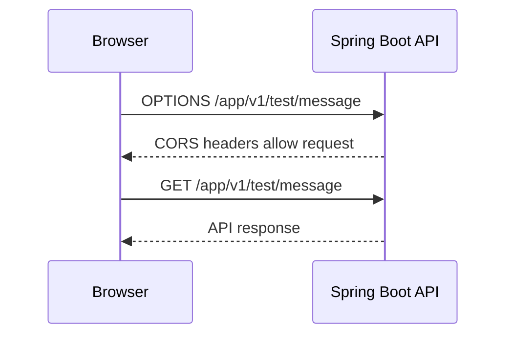

# Swagger UI With CORS Rules Tutorial

This tutorial explains how to use Swagger UI professionally when Swagger UI or another browser client is hosted on a different origin from the API. In that case, browser CORS rules apply.

## What CORS Solves

CORS means Cross-Origin Resource Sharing. It is a browser security mechanism that controls whether JavaScript loaded from one origin can call an API on another origin.

Different origins:

```text
Swagger UI: http://localhost:3000
API:        http://localhost:8080
```

Same host but different port still counts as different origin.

Also different origins:

```text
Swagger UI: https://docs.example.com
API:        https://api.example.com
```

CORS is enforced by browsers. It is not usually enforced by PowerShell, curl, backend services, or server-to-server calls.

## When Swagger UI Needs CORS

Swagger UI needs CORS when it is not served by the same origin as the API.

Common examples:

- Swagger UI is hosted as a static site.
- Swagger UI runs from a separate frontend development server.
- API docs are centralized in a developer portal.
- A gateway serves Swagger UI from one domain and APIs from another.
- A frontend application calls the same API from a browser.

If Swagger UI is served directly by the Spring Boot app at the same host and port as the API, use the no-CORS setup instead.

## Professional CORS Rule Design

Professional CORS rules should be explicit and minimal.

Good policy:

- Allow only known origins.
- Allow only required methods.
- Allow only required headers.
- Allow credentials only when cookies or browser auth are actually used.
- Keep production origins different from local development origins.
- Do not use wildcard origins with credentials.

Weak policy:

```text
Allow every origin, every method, every header, and credentials everywhere.
```

That may work during development, but it is a poor production default.

## Simple Spring Boot WebMVC CORS Configuration

For a Spring Boot WebMVC application, CORS can be configured with `WebMvcConfigurer`. This project now uses `src/main/java/sb/concepts/lab/config/CorsConfig.java` with values from `app.cors`.

Implemented shape for local Swagger UI hosted on port `3000`:

```java
package sb.concepts.lab.config;

import org.springframework.context.annotation.Bean;
import org.springframework.context.annotation.Configuration;
import org.springframework.web.servlet.config.annotation.CorsRegistry;
import org.springframework.web.servlet.config.annotation.WebMvcConfigurer;

@Configuration
public class CorsConfig {

    @Bean
    public WebMvcConfigurer corsConfigurer() {
        return new WebMvcConfigurer() {
            @Override
            public void addCorsMappings(CorsRegistry registry) {
                registry.addMapping("/app/**")
                        .allowedOrigins("http://localhost:3000")
                        .allowedMethods("GET", "POST", "PUT", "PATCH", "DELETE", "OPTIONS")
                        .allowedHeaders("Authorization", "Content-Type", "X-Request-Id", "X-Correlation-Id")
                        .exposedHeaders("X-Request-Id", "X-Correlation-Id")
                        .allowCredentials(false)
                        .maxAge(3600);
            }
        };
    }
}
```

This allows a browser app or externally hosted Swagger UI at `http://localhost:3000` to call API paths under `/app/**`.

## Include OpenAPI Paths When Needed

If external Swagger UI must fetch OpenAPI JSON from the API server, also allow `/v3/api-docs/**`.

```java
registry.addMapping("/v3/api-docs/**")
        .allowedOrigins("http://localhost:3000")
        .allowedMethods("GET", "OPTIONS")
        .allowedHeaders("Content-Type")
        .allowCredentials(false)
        .maxAge(3600);
```

Keep documentation routes and API routes separate when their CORS needs differ.

## Environment-Specific Origins

Do not hard-code every environment into Java if the values change by deployment. Use configuration properties.

Example YAML:

```yaml
app:
  cors:
    allowed-origins:
      - http://localhost:3000
    allowed-methods:
      - GET
      - POST
      - OPTIONS
```

Production-like YAML:

```yaml
app:
  cors:
    allowed-origins:
      - https://docs.example.com
      - https://admin.example.com
    allowed-methods:
      - GET
      - POST
      - OPTIONS
```

Professional profile guidance:

| Environment | Allowed Origins |
| --- | --- |
| local | Local frontend ports, for example `http://localhost:3000` |
| localstack | Local docs or frontend origins only |
| dev | Dev frontend or docs domain |
| qa | QA frontend or docs domain |
| prod | Production domains only, preferably behind HTTPS |

Never allow local origins like `http://localhost:3000` in real production unless there is a deliberate, documented reason.

## Credentials Rule

Credentials means browser cookies, HTTP authentication, or client certificates included in cross-origin requests.

If credentials are not needed:

```java
.allowCredentials(false)
```

If credentials are needed:

```java
.allowedOrigins("https://app.example.com")
.allowCredentials(true)
```

Do not combine credentials with wildcard origins:

```java
// Do not use this for credentialed browser requests.
.allowedOrigins("*")
.allowCredentials(true)
```

Browsers reject this pattern, and it is not a safe production model.

## Preflight Requests

For many cross-origin requests, the browser sends an `OPTIONS` request before the real request. This is called a preflight request.

The browser uses preflight to ask:

- Is this origin allowed?
- Is this HTTP method allowed?
- Are these request headers allowed?
- Can credentials be included?

Example flow:



If preflight fails, the browser blocks the real API request.

## CORS Headers To Understand

Common response headers:

| Header | Meaning |
| --- | --- |
| `Access-Control-Allow-Origin` | Which browser origin may read the response. |
| `Access-Control-Allow-Methods` | Which HTTP methods are allowed. |
| `Access-Control-Allow-Headers` | Which request headers are allowed. |
| `Access-Control-Expose-Headers` | Which response headers browser JavaScript can read. |
| `Access-Control-Allow-Credentials` | Whether credentials can be included. |
| `Access-Control-Max-Age` | How long the browser can cache preflight permission. |

For this project, exposing `X-Request-Id` and `X-Correlation-Id` is useful because the logging filter returns those values in responses.

## Swagger UI Server URL

When Swagger UI is hosted separately, configure the OpenAPI server URL carefully.

Example OpenAPI config:

```java
package sb.concepts.lab.config;

import io.swagger.v3.oas.models.OpenAPI;
import io.swagger.v3.oas.models.info.Info;
import io.swagger.v3.oas.models.servers.Server;
import org.springframework.context.annotation.Bean;
import org.springframework.context.annotation.Configuration;

import java.util.List;

@Configuration
public class OpenApiConfig {

    @Bean
    public OpenAPI applicationOpenAPI() {
        return new OpenAPI()
                .servers(List.of(new Server().url("http://localhost:8080")))
                .info(new Info()
                        .title("SB Concepts Lab API")
                        .description("API documentation for the Spring Boot concepts lab.")
                        .version("v1"));
    }
}
```

In production, use the public HTTPS API URL:

```text
https://api.example.com
```

Avoid exposing private internal hostnames in public OpenAPI documents.

## Testing CORS

Browser testing is the most reliable way to confirm CORS because CORS is a browser policy.

You can also inspect preflight behavior with PowerShell:

```powershell
Invoke-WebRequest `
  -Method Options `
  -Uri "http://localhost:8080/app/v1/test/message" `
  -Headers @{
    "Origin" = "http://localhost:3000"
    "Access-Control-Request-Method" = "GET"
  }
```

Check that the response contains appropriate CORS headers.

Then test the real request:

```powershell
Invoke-WebRequest `
  -Method Get `
  -Uri "http://localhost:8080/app/v1/test/message" `
  -Headers @{
    "Origin" = "http://localhost:3000"
  }
```

Remember that PowerShell may receive the response even when a browser would block JavaScript from reading it. Browser developer tools are the final check.

## Common Browser Errors

Error:

```text
No 'Access-Control-Allow-Origin' header is present on the requested resource.
```

Meaning:

- The API did not allow the browser origin.
- The request path may not match the CORS mapping.
- The request may have failed before CORS headers were added.

Error:

```text
Method DELETE is not allowed by Access-Control-Allow-Methods.
```

Meaning:

- The origin may be allowed, but the HTTP method is not.

Error:

```text
Request header field authorization is not allowed by Access-Control-Allow-Headers.
```

Meaning:

- The browser wants to send `Authorization`, but the CORS config does not allow it.

Error:

```text
The value of the 'Access-Control-Allow-Credentials' header in the response is '' which must be 'true'
```

Meaning:

- The browser request includes credentials, but the API did not allow credentialed requests.

## CORS With Spring Security

If Spring Security is later added, CORS must be integrated with the security filter chain. Otherwise, preflight requests may be rejected before MVC CORS rules apply.

Professional direction:

```java
// Example direction only. Match this to the Spring Security version used by the project.
http.cors(cors -> {});
```

Also ensure preflight `OPTIONS` requests are not blocked by authentication rules.

Without Spring Security, the `WebMvcConfigurer` approach is usually enough for a simple WebMVC application.

## Production Safety Checklist

Before enabling CORS in production:

- List the exact browser origins that need access.
- Use HTTPS origins.
- Avoid `*` unless the API is intentionally public and credential-free.
- Avoid `allowCredentials(true)` unless needed.
- Allow only required methods.
- Allow only required headers.
- Expose only useful response headers.
- Keep local development origins out of production config.
- Test with real browser developer tools.
- Review Swagger UI Try it out access for write operations.

## Recommended Setup For This Project

For this project, these defaults are implemented:

1. Swagger UI is available from the Spring Boot app for same-origin use.
2. CORS applies to `/app/**` for API calls.
3. CORS applies to `/v3/api-docs/**` for external Swagger UI.
4. Local browser origins include `http://localhost:3000` and `http://localhost:5173`.
5. `X-Request-Id` and `X-Correlation-Id` are exposed so browser clients can report IDs from logs.
6. Shared and production-like profiles use explicit HTTPS placeholder origins.

CORS should be treated as part of the API security boundary. Add it deliberately, keep it narrow, and test it in a browser.

## Hinglish Summary

CORS ki zarurat tab hoti hai jab browser me loaded Swagger UI ya frontend app API ko different origin se call karta hai. Origin scheme, host, aur port ka combination hota hai.

Cross-origin example:

```text
Swagger UI: http://localhost:3000
API:        http://localhost:8080
```

Same machine par hone ke baad bhi ports different hain, isliye browser isko cross-origin treat karega.

CORS browser security feature hai. PowerShell, curl, ya backend-to-backend calls normally CORS enforce nahi karte. Isliye CORS issue test karne ke liye browser developer tools important hain.

Professional CORS rules:

- Sirf known origins allow karo.
- Sirf required HTTP methods allow karo.
- Sirf required headers allow karo.
- Credentials tabhi allow karo jab cookies ya browser auth actually use ho rahe hon.
- Production me local origins jaise `http://localhost:3000` allow mat rakho.
- `allowCredentials(true)` ke saath wildcard origin `*` use mat karo.

Is project me CORS config `CorsConfig` aur `app.cors` properties se implement ho chuka hai. Spring Boot WebMVC me basic CORS config `WebMvcConfigurer` se hota hai:

```java
registry.addMapping("/app/**")
        .allowedOrigins("http://localhost:3000")
        .allowedMethods("GET", "POST", "OPTIONS")
        .allowedHeaders("Authorization", "Content-Type", "X-Request-Id", "X-Correlation-Id")
        .exposedHeaders("X-Request-Id", "X-Correlation-Id")
        .allowCredentials(false);
```

External Swagger UI ko OpenAPI JSON read karna ho to `/v3/api-docs/**` ke liye bhi CORS allow karna padega.

Testing ke liye browser me Swagger UI open karke Try it out use karo. PowerShell se preflight inspect kar sakte ho:

```powershell
Invoke-WebRequest `
  -Method Options `
  -Uri "http://localhost:8080/app/v1/test/message" `
  -Headers @{
    "Origin" = "http://localhost:3000"
    "Access-Control-Request-Method" = "GET"
  }
```

Short recommendation: CORS ko security boundary ki tarah treat karo. Rules narrow rakho, origins environment-specific rakho, production me HTTPS origins use karo, aur final testing browser me karo.
