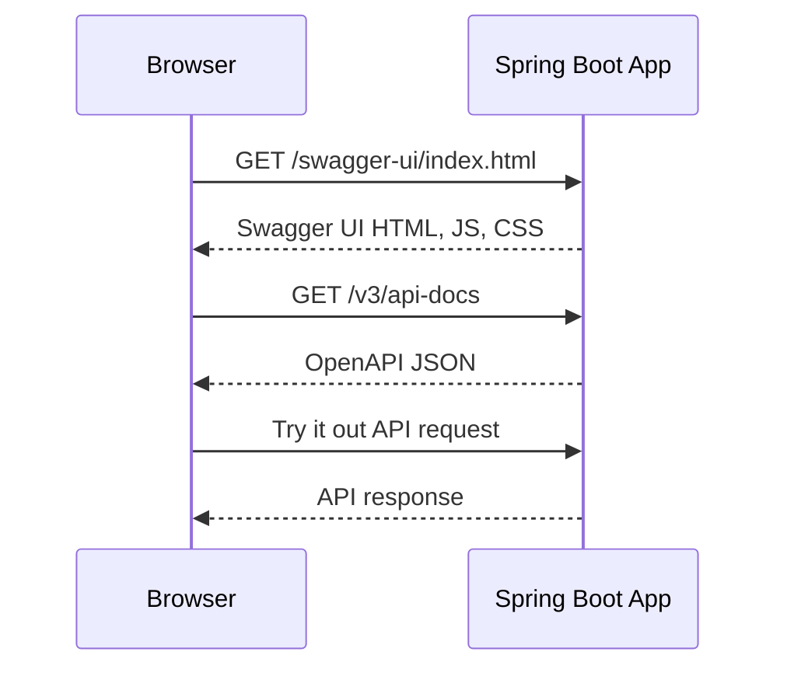

# Swagger UI Without CORS Tutorial

This tutorial explains how to use Swagger UI professionally when CORS is not required. This is the simplest and safest setup for most Spring Boot APIs during local development and internal service documentation.

## When CORS Is Not Required

CORS is not needed when Swagger UI and the API are served from the same origin.

An origin is the combination of:

- Scheme: `http` or `https`
- Host: `localhost`, domain name, or IP address
- Port: `8080`, `443`, `3000`, and so on

Same origin example:

```text
Swagger UI: http://localhost:8080/swagger-ui/index.html
API docs:   http://localhost:8080/v3/api-docs
API call:   http://localhost:8080/app/v1/test/message
```

Because all requests use `http://localhost:8080`, the browser does not need CORS permission.

Cross-origin example:

```text
Swagger UI: http://localhost:3000
API docs:   http://localhost:8080/v3/api-docs
API call:   http://localhost:8080/app/v1/test/message
```

This does require CORS because the ports are different.

## Recommended Professional Default

For most backend projects, start without custom CORS rules:

- Serve Swagger UI from the same Spring Boot application.
- Keep API docs behind the same host and port.
- Avoid global CORS configuration until there is a real browser client on a different origin.
- Do not add permissive `*` CORS rules just to make errors disappear.

No-CORS setup is simpler, safer, and easier to deploy.

## Add Swagger UI To A Spring Boot WebMVC App

This project uses Spring Boot WebMVC and now includes `springdoc-openapi` for Swagger UI.

Implemented dependency in `pom.xml`:

```xml
<dependency>
    <groupId>org.springdoc</groupId>
    <artifactId>springdoc-openapi-starter-webmvc-ui</artifactId>
    <version>${springdoc-openapi.version}</version>
</dependency>
```

After adding the dependency, start the application:

```powershell
.\mvnw.cmd spring-boot:run "-Dspring-boot.run.profiles=local"
```

Open Swagger UI:

```text
http://localhost:8080/swagger-ui/index.html
```

Open the raw OpenAPI JSON:

```text
http://localhost:8080/v3/api-docs
```

For this project, existing endpoints include:

```text
GET  /app/v1/test/message
POST /app/v1/test?string=hello
GET  /app/v1/test/cloud
POST /app/v1/test/cloud?string=hello
```

## Same-Origin Flow

In a same-origin setup, the browser loads Swagger UI and calls the API from the same backend.



Since every request goes to the same origin, no browser CORS preflight is needed.

## Recommended OpenAPI Metadata

The project exposes clear API metadata through `src/main/java/sb/concepts/lab/config/OpenApiConfig.java`.

Current configuration shape:

```java
package sb.concepts.lab.config;

import io.swagger.v3.oas.models.OpenAPI;
import io.swagger.v3.oas.models.info.Info;
import org.springframework.context.annotation.Bean;
import org.springframework.context.annotation.Configuration;

@Configuration
public class OpenApiConfig {

    @Bean
    public OpenAPI applicationOpenAPI() {
        return new OpenAPI()
                .servers(List.of(new Server().url("/")))
                .info(new Info()
                        .title("SB Concepts Lab API")
                        .description("API documentation for the Spring Boot concepts lab.")
                        .version("v1"));
    }
}
```

Keep metadata accurate. Swagger UI is often the first API document seen by developers and testers.

## Document Controllers Professionally

Use annotations only where they add value. Do not over-document obvious code.

Example:

```java
import io.swagger.v3.oas.annotations.Operation;
import io.swagger.v3.oas.annotations.tags.Tag;

@Tag(name = "Test API", description = "Simple endpoints for profile and cloud behavior checks")
@RestController
@RequestMapping("app/v1/test")
public class TestController {

    @Operation(summary = "Return a test message")
    @GetMapping("/message")
    public String test() {
        return "test";
    }
}
```

Good Swagger descriptions explain:

- What the endpoint is for.
- Required parameters.
- Important response behavior.
- Authentication requirements when security exists.
- Error responses when the API has stable error contracts.

Avoid descriptions that merely repeat the method name.

## Profile-Specific Access

Decide where Swagger UI should be enabled.

Common professional policy:

| Environment | Swagger UI Policy |
| --- | --- |
| local | Enabled |
| localstack | Enabled |
| dev | Enabled or protected |
| qa | Enabled or protected |
| prod | Disabled, protected, or exposed only internally |

If production Swagger UI is enabled, protect it with authentication, network restrictions, or both.

## Same-Origin Reverse Proxy Setup

In real environments, a reverse proxy can keep Swagger UI and the API under one origin.

Example:

```text
https://api.example.com/swagger-ui/index.html
https://api.example.com/v3/api-docs
https://api.example.com/app/v1/test/message
```

This avoids CORS while still supporting a professional deployment.

Typical routing:

```text
/swagger-ui/** -> Spring Boot app
/v3/api-docs  -> Spring Boot app
/app/**       -> Spring Boot app
```

## Security Notes

Swagger UI can expose useful information about your API surface.

Do not expose publicly without thinking about:

- Authentication.
- Internal-only endpoints.
- Example payloads containing sensitive data.
- Error schema details.
- Server URLs that reveal private infrastructure.
- Try-it-out access to write operations.

Swagger UI is documentation, but it is also an interactive API client.

## Troubleshooting

If Swagger UI does not open:

- Confirm the OpenAPI dependency is present.
- Restart the application after changing `pom.xml`.
- Check the application startup logs for mapping errors.
- Try `/v3/api-docs` directly.
- Confirm the application is running on the expected port.

If `/v3/api-docs` works but Swagger UI does not:

- Check the exact Swagger UI path for the dependency version.
- Clear browser cache.
- Check browser developer tools for failed static files.

If Try it out fails:

- Confirm the endpoint works through PowerShell.
- Check request parameters and HTTP method.
- Check application logs.
- Confirm the endpoint does not require authentication.

Example PowerShell check:

```powershell
Invoke-RestMethod -Method Get -Uri "http://localhost:8080/app/v1/test/message"
```

## Professional Checklist

Use no-CORS Swagger UI when:

- Swagger UI is served by the same Spring Boot application.
- The API and docs use the same scheme, host, and port.
- There is no separate browser frontend calling the API.
- You want the safest default for local and internal API docs.

Before merging Swagger UI setup:

- Confirm `/swagger-ui/index.html` loads.
- Confirm `/v3/api-docs` returns JSON.
- Confirm Try it out works for safe endpoints.
- Decide whether Swagger UI should be enabled in each profile.
- Avoid adding unnecessary CORS rules.

Start with no CORS. Add CORS only when a real cross-origin browser client needs it.

## Hinglish Summary

Swagger UI without CORS tab best hota hai jab Swagger UI aur API same origin se serve ho rahe hote hain. Same origin ka matlab same scheme, host, aur port.

Same-origin example:

```text
Swagger UI: http://localhost:8080/swagger-ui/index.html
API docs:   http://localhost:8080/v3/api-docs
API call:   http://localhost:8080/app/v1/test/message
```

Yaha browser ko CORS permission ki zarurat nahi hai, kyunki sab kuch `http://localhost:8080` se aa raha hai.

Professional default ye hona chahiye:

- Swagger UI ko same Spring Boot application se serve karo.
- `/swagger-ui/index.html`, `/v3/api-docs`, aur API endpoints same host/port par rakho.
- Jab tak real cross-origin browser frontend na ho, CORS rules add mat karo.
- Sirf error fix karne ke liye permissive `*` CORS config mat lagao.

Is Spring Boot WebMVC app me Swagger UI ke liye `springdoc-openapi-starter-webmvc-ui` dependency add ho chuki hai. API metadata `OpenApiConfig` se provide hota hai.

Run command:

```powershell
.\mvnw.cmd spring-boot:run "-Dspring-boot.run.profiles=local"
```

Open:

```text
http://localhost:8080/swagger-ui/index.html
http://localhost:8080/v3/api-docs
```

Short recommendation: pehle no-CORS setup use karo because ye simple aur safer hai. CORS tabhi add karo jab Swagger UI ya frontend API se different origin par hosted ho.
